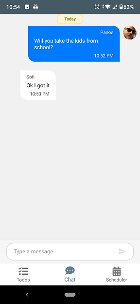
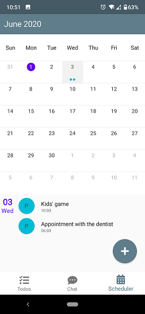
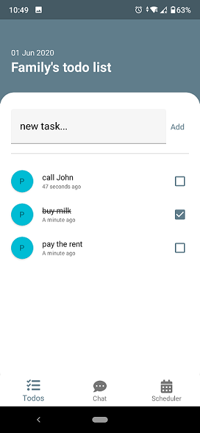

# FamilyHub
RnD project. Android platform only. But C# code (Xamarin Forms)

## Description
A simple family organizer app built with xamarin forms, utilizing Google's Firebase realtime database for the backend

## Screenshots

## Features
* Authentication with email and password
* Todos list
* Chat
* Scheduler
* Push notifications

## Packages
* FirebaseAuthentication.net
* FirebaseDatabase.net
* Plugin.FirebasePushNotification
* Syncfusion.Xamarin.SfSchedule
* Syncfusion.Xamarin.SfChat
* MonkeyCache.SQLite
* Acr.UserDialogs

- [me] 2022

